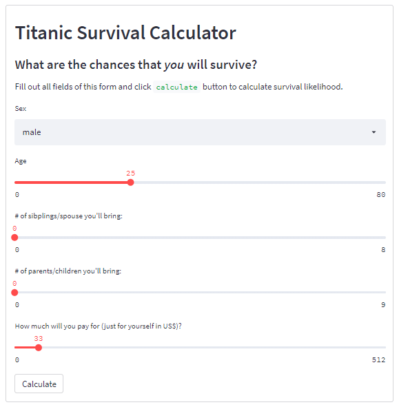

## Titanic Survival Calculator: Estimating your chances of survival from the Titanic mishap
Calculates the survival probability and estimated survival status of the user based on their inputs

### Description of this project
This work aims at estimating the user's likelihood of surviving the Titanic incident should they be one of the unlucky passengers of the great ship. The dataset was downloaded from **[data.world](https://data.world/nrippner/titanic-disaster-dataset)**. It was preprocessed and features were selected based from the usual data that the user can supply. Six models were trained and included in the calculator to give its individual survival predictions and probabilities, and make an ensemble of their predictions that will serve as the final estimation of the user's chances of surviving. The web form was created using **[`streamlit`](https://streamlit.io/)**.

### Data preprocessing
The dataset was downloaded from **[data.world](https://data.world/nrippner/titanic-disaster-dataset)**. There are 12 features and 1 response (`survival` column). The below table summarizes what each column has. It also explains if they were removed, and the reason why they were removed.
| Name of column          | Description                                                          | Removed from the model                                      |
| ------------------------| -------------------------------------------------------------------- | ----------------------------------------------------------- |
| `survival`              | Survival (0 = No; 1 = Yes)                                           | No   - response                                             |
| `class`                 | Passenger Class (1 = 1st; 2 = 2nd; 3 = 3rd)                          | Yes  - `fare` was used instead                              |
| `name`                  | Name of passenger                                                    | Yes  - irrelevant, too many unique values                   |
| `sex`                   | Sex of passenger                                                     | No                                                          |
| `age`                   | Age of passenger                                                     | No                                                          |
| `sibsp`                 | Number of Siblings/Spouses Aboard                                    | No                                                          |
| `parch`                 | Number of Parents/Children Aboard                                    | No                                                          |
| `ticket`                | Ticket Number                                                        | Yes  - irrelevant, too many unique values                   |
| `fare`                  | Passenger Fare                                                       | No                                                          |
| `cabin`                 | Cabin                                                                | Yes  - irrelevant, too many unique values                   |
| `embarked`              | Port of Embarkation (C = Cherbourg; Q = Queenstown; S = Southampton) | Yes  - not determined if this can be supplied by the user   |
| `boat`                  | Lifeboat (if survived)                                               | Yes  - used only for passengers who survived                |
| `body`                  | Body number (if did not survive and body was recovered)              | Yes  - used only for passengers who did not survived        |

From the five features that were retained only `fare` (1) and `age` (263) had missing values. The missing `fare` values were replaced with median `fare`, while the missing `age` values were replaced with random values between the minimum and maximum values of `age` column (seed was set for reproducibility). `sex` were recoded to replace 'female` with 1, and 'male' with 0. All columns are type int except for `fare` and `age`.

### Model training and hyperparameter tuning
Six models were trained and included in the calculator to give its individual survival predictions and probabilities. Those models were `LogisticRegression`, `DecisionTreeClassifier`, `KNeighborsClassifier`, `SVC`, `RandomForestClassifier`, and `XGBClassifier`. Default parameters were used first (with custom seed for `RandomForestClassifier`), then different parameter values were supplied for hyperparameter tuning. `RepeatedStratifiedKFold` with 10 splits and 3 repeats was used for cross validation. The best parameters that were identified are as follows.
| Model Name                 | Best parameters                                                                  |
| -------------------------- | -------------------------------------------------------------------------------- |
| `LogisticRegression`       | {'C': 10, 'solver': 'newton-cg'}                                                 |
| `DecisionTreeClassifier`   | {'max_depth': 5}                                                                 |
| `KNeighborsClassifier`     | {'metric': 'manhattan', 'n_neighbors': 7, 'weights': 'uniform'}                  |
| `SVC`                      | {'C': 50, 'kernel': 'rbf'}                                                       |
| `RandomForestClassifier`   | {'max_features': 'sqrt', 'n_estimators': 1000}                                   |
| `XGBClassifier`            | {'learning_rate': 0.01, 'max_depth': 3, 'n_estimators': 1000, 'subsample': 0.5}  |

### Survival prediction and probability calculator

All six models were used to make an ensemble of their predictions that will serve as the final estimation of the user's chances of surviving. The web form was created using **[`streamlit`](https://streamlit.io/)**. It presents each model's prediction and calculated probability of surviving the Titanic incident. The user enters the inputs using the `streamlit` widgets, and clicks `Calculate` button to get the prediction and probability per model, and their ensemble and final decision.

### Scripts used
This repository contains three scripts that were used for every stage of this project. Each script pulls the source data from this repository. 
- `titanic_preprocess.py` reads and processes the Titanic dataset to arrive at the version that will be used for data modeling; `titanic.csv` is read from this repository
- `titanic_models.py` trains six models and fits data in each model that went through hyperparameter tuning to get the best parameters; `titanic_cleaned.csv` is read from this repository
- `titanic_calc_app.py` launches the `streamlit` web form where a user supplies input data to get survival predictions and likelihood; `titanic_cleaned.csv` is read from this repository; to run, type `streamlit run titanic_calc_app.py` on the console
